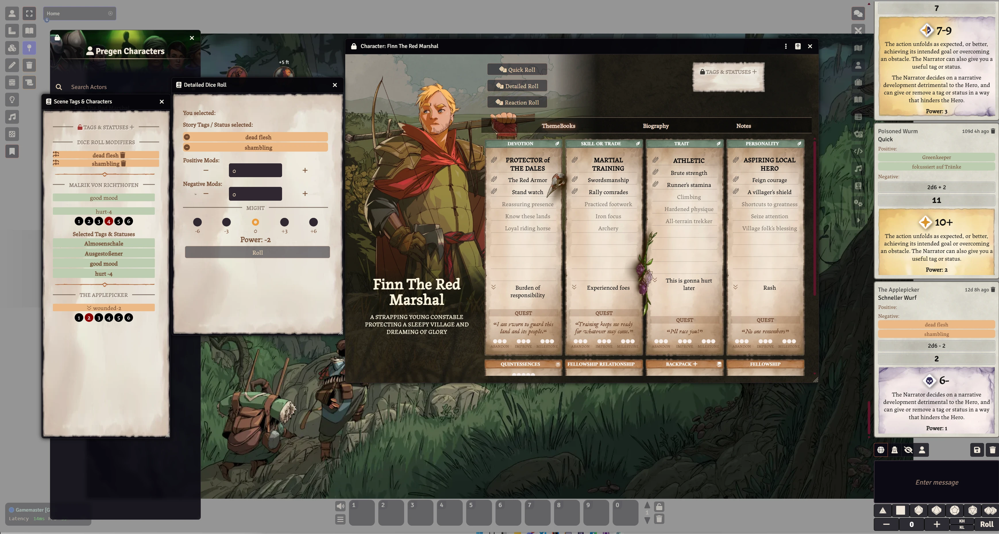

# Legend In The Mist for FoundryVTT

 

This is the official system implementation of Legend In The Mist from Son Of Oaks for FoundryVTT.

The system contains 3 official pregenerated characters with full artwork for free.

  
## KeyBindings  
 * Control + J -> Open Scene Tags
 * Control + H -> Open How To Play
 * Alt + T -> Open the ThemeKit selection for your character

## Character sheet layouts

Hero sheets come in two layouts, switchable per character from the controls menu in the sheet's window header (or via *Configure Sheet*):

 * **Full layout with artwork** (default) - reserves a column on the left for the character's artwork, built with the Custom Background Editor.
 * **Compact layout** - no artwork column, the portrait sits next to the roll buttons and the window is noticeably narrower. Everything else works identically; a stored custom background is kept and reappears when you switch back.

## Manifest-URL for manual installation of the system

    https://github.com/MrTheBino/mist-engine-fvtt/releases/latest/download/system.json

## Tags & Status Markdown

You can use these formatting in almost every text field to display a MIST engine style tag or status

    [tag] - a simple tag
    [status-1] - a status with tier 1, tier 1-6
    [/s status] - a status without a tier, usage in a journal for example
    [/s status-2] - a status  of tier 2
    [/sn status] - a negative status, counts against the roll
    [/sn status-2] - a negative status of tier 2
    [/m might] - a might word with a sword icon before
    [/ma might] - a might of type adventure
    [/mg might] - a might of type greatness
    [/mo might] - a might of type origin
    [/l limit] - a limit without a value
    [/l limit-X] - a limit with the value X
    [/w weakness] - a weakness tag, usage in text and compendiums for example
    [/b text] - bold text

An Example

    The fox jumps and [breaks-2] his leg. Now he's very [fatigued-2] and [sad]

This system uses at present code snippets and graphics from the City of Mist HUD module.

## Development

  npm install
  npm run watch (CSS live build)
  npm run pack-compendium (builds the foundry compendium entries)
  npm run unpack-compendium (unpacks the foundry compendium entries to json files in src/packs)

## Foundry VTT Preview Screenshot
